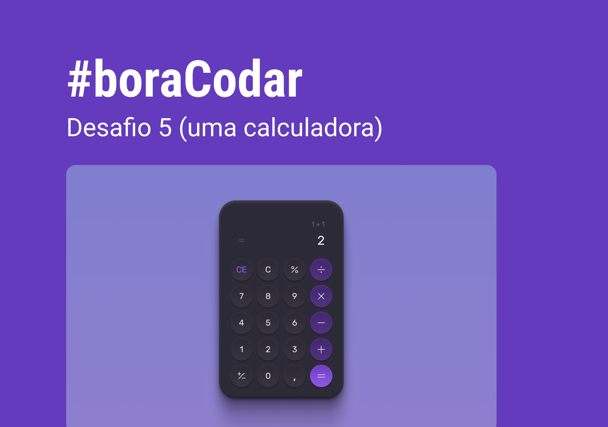

<h1 align="center">
    
</h1>

 

## 🧪 Tecnologias

Esse projeto foi desenvolvido usando as seguintes tecnologias:

- HTML
  - uso de aria-label para leitores de tela em teclas onde o conteúdo é um ícone.
- CSS:
  - display Grid
  - animações como zoom no hoover e ripple ao clique.
- Javascript:
  - `listener` para efeito ripple do botão.

## 🔖 Layout

Você pode visualizar o layout do projeto através do link abaixo:

- [Layout Web](https://www.figma.com/community/file/1202607074523509182)

Lembrando que você precisa ter uma conta no [Figma](http://figma.com/).

## 💻 Projeto

Uma calculadora.

Este foi um projeto desenvolvido como resposta ao desafio 5 do **[boracodar](https://boracodar.dev/#)**, em 6 de fevereiro de 2023.

## Melhorias que podem ser implementadas

- [ ] Realizar as operações com Javascript.
