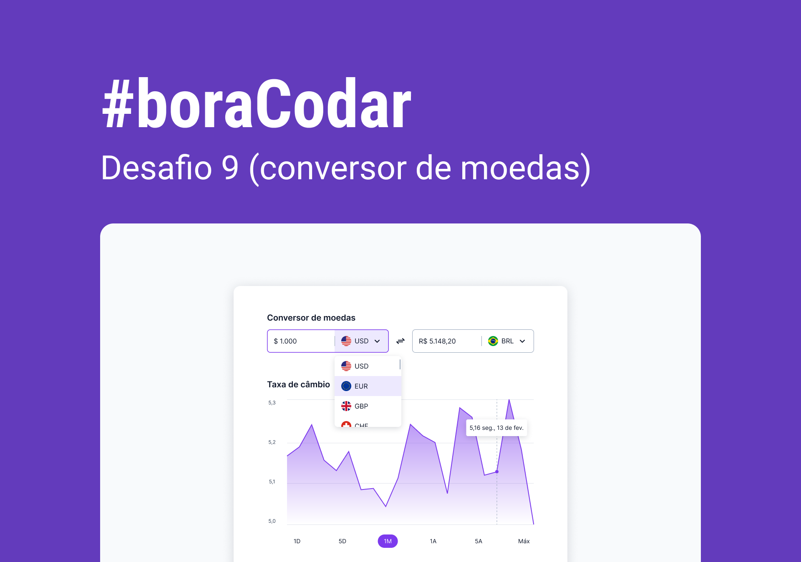

<h1 align="center">
    
</h1>

 

## 🧪 Tecnologias

Esse projeto foi desenvolvido usando as seguintes tecnologias:

- HTML

  - Uso do `<select>`, `<option>` e `<input type="radio"` para seleções.

- CSS:

  - Uso de uma estratégia de adição extra de padding ao campo do select permitindo permitindo que tanto a bandeira à esquerda como a caixa de seleção à direita integrem o clique por meio de `pointer-events: none` aplicados nestes elementos.
  - Uso de `linear-gradient` para confeção de linhas horizontais.
  - Construção da área do gráfico com `clip-path`e múltiplos overlays.

- Javascript

  - Mudança da bandeira no `wrapper` do `<select>`.

## 🔖 Layout

Você pode visualizar o layout do projeto através do link abaixo:

- [Layout Web](https://www.figma.com/community/file/1212757179376046656)

Lembrando que você precisa ter uma conta no [Figma](http://figma.com/).

## 💻 Projeto

Um conversor de moedas.

Este foi um projeto desenvolvido como resposta ao desafio 8 do **[boracodar](https://boracodar.dev/#)**, em 09 de março de 2023.
