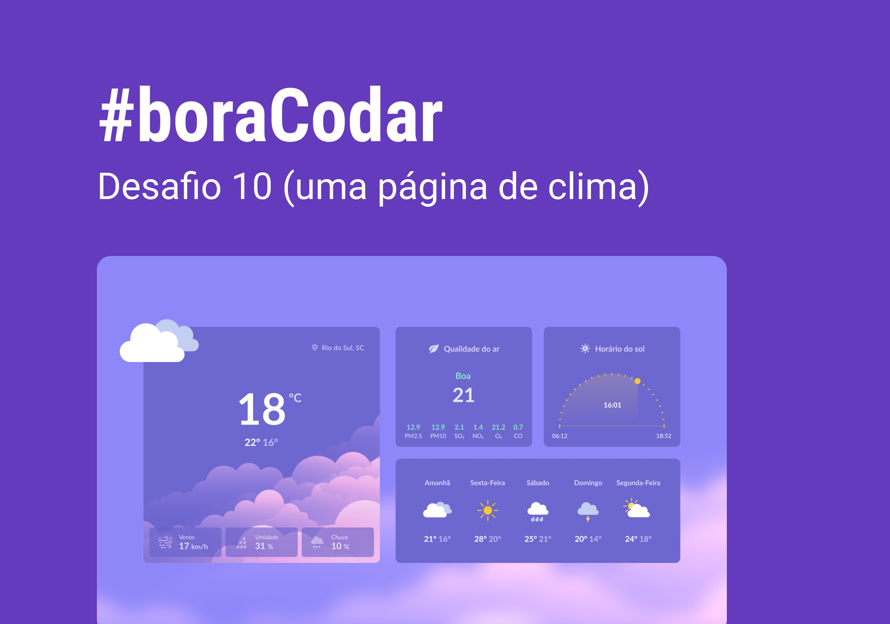

<h1 align="center">
    
</h1>

 

## 🧪 Tecnologias

Esse projeto foi desenvolvido usando as seguintes tecnologias:

- HTML

  - Uso do datalist `<dl>`, `<dt>` e `<dd>` para diferentes listas. O uso de `<ul>` não permite o uso de filhos que não seja `<li>`. No projeto em questão utilizamos `
` com função de layout e `` como filhos da tag `<dl>`.

- CSS:

  - Uso de `display: grid` e `backdrop-filter: blur`
  - Construção da área do gráfico com com múltiplos overlays.

## 🔖 Layout

Você pode visualizar o layout do projeto através do link abaixo:

- [Layout Web](https://www.figma.com/community/file/1215291914714743267)

Lembrando que você precisa ter uma conta no [Figma](http://figma.com/).

## 💻 Projeto

Uma página de previsão do tempo.

Este foi um projeto desenvolvido como resposta ao desafio 8 do **[boracodar](https://boracodar.dev/#)**, em 13 de março de 2023.
