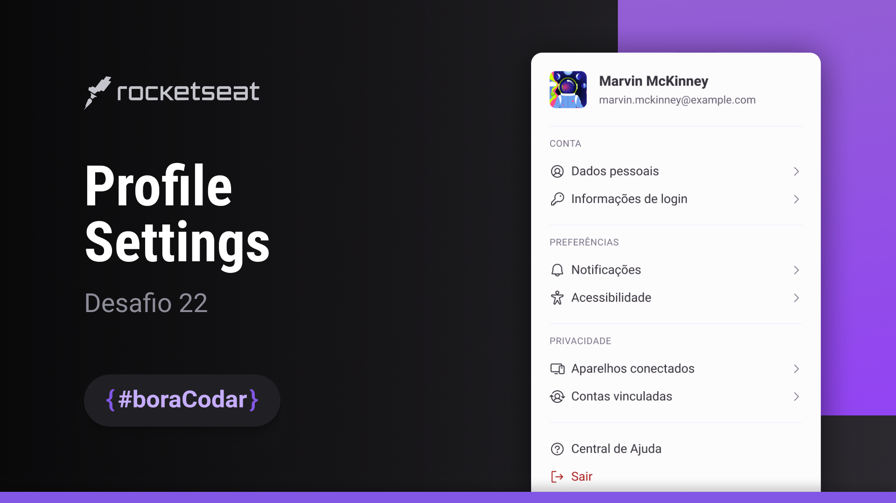

<h1 align="center">
    
</h1>

 

## 🧪 Tecnologias

Esse projeto foi desenvolvido usando as seguintes tecnologias:

- HTML

  Fiz o mais semântico possível.

  Utilizei as tags `dl`, `dt`, e `dd` para criar a lista de configurações do perfil. Isto permitiu que não fosse necessária nenhuma tag `
` ou `<section>` para formatação adicional.

  Também utilizei o recursos de `aria-hidden:true` nos ícones, uma vez que, acompanhados do texto de descrição, não faz sentido duplicar a descrição para um leitor de tela.

- CSS:

  Mudança na estratégia de uso do `rem` no tamanho da fonte em uso no html do documento.

  **_Obs.: esta estratégia pode estar repetida aqui e talvez já tenha sido explicada anteriormente. A razão é que quebrei a seqüência dos desafios._**

  Ao invés de utilizar uma redução a 62.5% e depois a definição do tamanho como 1.6rem, utilizo uma estratégia de `css variables` para definir o tamanho das fontes. O motivo principal para a adoção desta nova estratégia nos meus projetos a partir deste momento são explicados em detalhes no artigo [The Surprising Truth About Pixels and Accessibility](https://www.joshwcomeau.com/css/surprising-truth-about-pixels-and-accessibility/) do [Josh Comeau](https://www.joshwcomeau.com).

  Por esta mesma razão passo a utilizar detalhes gráficos dos elementos do layout como `border` e `border-radius` em `px`.

  Eu normalmente uso o [Josh Comeau](https://www.joshwcomeau.com) e também o [Kevin Powell]() como referências para `css`.

## 🎯 Resultado

Você pode visualizar o resultado do projeto [aqui](https://rafaelreisramos.github.io/boracodar.dev/22_profile-settings/).

## 🔖 Layout

Você pode visualizar o layout do projeto [aqui](https://www.figma.com/community/file/1245736372337157133).

Lembrando que você precisa ter uma conta no [Figma](http://figma.com/).

## 💻 Projeto

Um card de configurações do perfil de usuário.

Este foi um projeto desenvolvido como resposta ao desafio 22 do **[boracodar](https://boracodar.dev/#)**, em 6 de junho de 2023.
