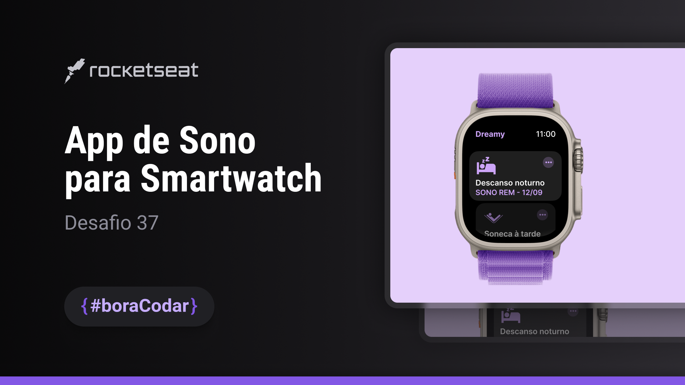

<h1 align="center">
    
</h1>

 

## 🧪 Tecnologias

Neste projeto, pelas características de dimensões fixas das figuras e máscaras do relǵio, decidi usar as dimensões do layout em `px`.

O projeto não segue fielmente os espaçamentos do design. Fiz alguns ajustes nos tamanhos dos ícones e cards do relógio.

Esse projeto foi desenvolvido usando as seguintes tecnologias:

- HTML
- CSS
- Javascript

  - Controle do item selecionado no "carrossel" baseado no scroll.

## 🔖 Layout

Você pode visualizar o layout do projeto através do link abaixo:

- [Layout Web](https://www.figma.com/community/file/1283783865388732530/App-de-Sono-para-Smartwatch-E280A2-Desafio-37)

Lembrando que você precisa ter uma conta no [Figma](http://figma.com/).

## 💻 Projeto

Um app de controle de sono em um smartwatch.

Este foi um projeto desenvolvido como resposta ao desafio 37 do **[boracodar](https://boracodar.dev/#)**, em 19 de setembro de 2023.
