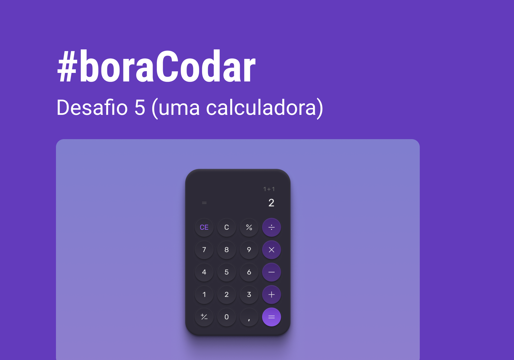

Códigos resposta dos desafios propostos pela [Rocketseat](https://www.rocketseat.com.br/) em **[boracodar.dev](https://boracodar.dev/)**

| #   | Name                | Design                                                            | Code                                                                                          | Deploy                                                                                     | Preview                                                                                                                      |
| :-- | :------------------ | :---------------------------------------------------------------- | :-------------------------------------------------------------------------------------------- | :----------------------------------------------------------------------------------------- | :--------------------------------------------------------------------------------------------------------------------------- |
| 01  | Music Player        |                                                               |                                                                                           |                                                                                        |                                                                                                                         |
| 02  | Product Card        | [:art:](https://www.figma.com/community/file/1195050984449538256) | [:octocat:](https://github.com/rafaelreisramos/boracodar.dev/tree/main/02_product-card)       | [:checkered_flag:](https://rafaelreisramos.github.io/boracodar.dev/02_product-card/)       |        |
| 03  | Buttons and Cursors | [:art:](https://www.figma.com/community/file/1197534710257750520) | [:octocat:](https://github.com/rafaelreisramos/boracodar.dev/tree/main/03_button-docs)        | [:checkered_flag:](https://rafaelreisramos.github.io/boracodar.dev/03_button-docs/)        |          |
| 04  | Chat                | [:art:](https://www.figma.com/community/file/1200070743637495660) | [:octocat:](https://github.com/rafaelreisramos/boracodar.dev/tree/main/04_chat)               | [:checkered_flag:](https://rafaelreisramos.github.io/boracodar.dev/04_chat/)               |                        |
| 05  | Calculator          | [:art:](https://www.figma.com/community/file/1202607074523509182) | [:octocat:](https://github.com/rafaelreisramos/boracodar.dev/tree/main/05_calculator)         | [:checkered_flag:](https://rafaelreisramos.github.io/boracodar.dev/05_calculator/)         |            |
| 06  | Boarding Pass       | [:art:](https://www.figma.com/community/file/1205146101173113980) | [:octocat:](https://github.com/rafaelreisramos/boracodar.dev/tree/main/06_boarding-pass)      | [:checkered_flag:](https://rafaelreisramos.github.io/boracodar.dev/06_boarding-pass/)      |      |
| 07  | Carnaval Web Site   | [:art:](https://www.figma.com/community/file/1207675804423978995) | [:octocat:](https://github.com/rafaelreisramos/boracodar.dev/tree/main/07_find-your-block)    | [:checkered_flag:](https://rafaelreisramos.github.io/boracodar.dev/07_find-your-block/)    |  |
| 08  | Dashboard           | [:art:](https://www.figma.com/community/file/1210217615683203825) | [:octocat:](https://github.com/rafaelreisramos/boracodar.dev/tree/main/08_dashboard)          | [:checkered_flag:](https://rafaelreisramos.github.io/boracodar.dev/08_dashboard/)          |              |
| 08  | Currency Converter  | [:art:](https://www.figma.com/community/file/1212757179376046656) | [:octocat:](https://github.com/rafaelreisramos/boracodar.dev/tree/main/09_currency-converter) | [:checkered_flag:](https://rafaelreisramos.github.io/boracodar.dev/09_currency-converter/) |     |
