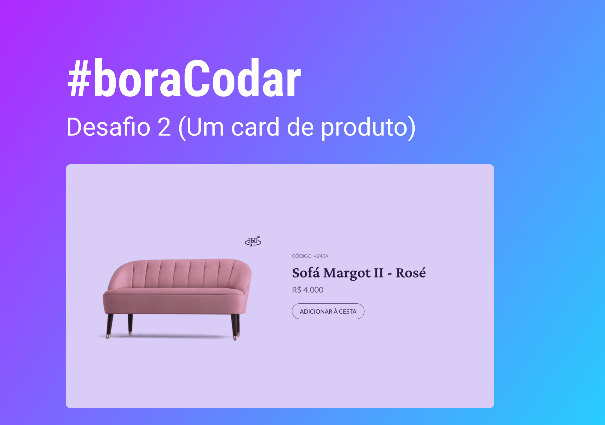

<h1 align="center">
    
</h1>

 

## 🧪 Tecnologias

Esse projeto foi desenvolvido usando as seguintes tecnologias:

- HTML
- CSS
- Javascript

## 🔖 Layout

Você pode visualizar o layout do projeto através do link abaixo:

- [Layout Web](https://www.figma.com/community/file/1195050984449538256)

Lembrando que você precisa ter uma conta no [Figma](http://figma.com/).

## 💻 Projeto

Um cartão de produto.

Este foi um projeto desenvolvido como resposta ao desafio 2 do **[boracodar](https://boracodar.dev/#)**, em 10 de janeiro de 2023.

## 📝 License

Esse projeto está sob a licença MIT. Veja o arquivo [LICENSE](LICENSE.md) para mais detalhes.
