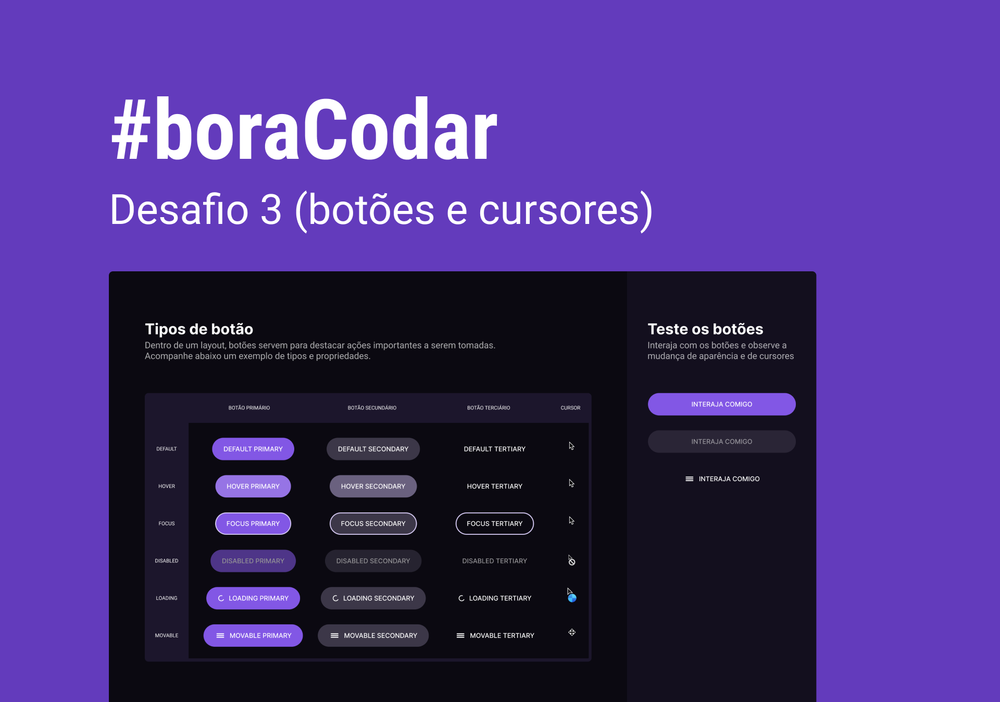

<h1 align="center">
    
</h1>

 

## 🧪 Tecnologias

Esse projeto foi desenvolvido usando as seguintes tecnologias:

- HTML: tabela criada usando a odiada tag `<table>`
- CSS: formatação da tabelas usando pseudo seletores `last,first,nth-child`, animação do loading com `@keyframes`

**Obs.:** A tag `<table>` implica em uma série de desafios de formatação e layout para reponsividade. Por este motivo muitas pessoas relutam em usá-la. No primeiro momento não nos preocupamos com responsividade, mas somente em reproduzir o layout sugerido.

## 🔖 Layout

Você pode visualizar o layout do projeto através do link abaixo:

- [Layout Web](https://www.figma.com/community/file/1197534710257750520)

Lembrando que você precisa ter uma conta no [Figma](http://figma.com/).

## 💻 Projeto

Um design system de botões e cursores.

Este foi um projeto desenvolvido como resposta ao desafio 3 do **[boracodar](https://boracodar.dev/#)**, em 24 de janeiro de 2023.

## Melhorias que podem ser implementadas

- [ ] Responsividade da tabela para telas menores que `768px` usando `display: block` e reposicionando as colunas de primário, secundário e terciário em colunas.
- [ ] Melhoria das dimensões do layout para a regra dos 8.
- [ ] Animação para o botão movable
