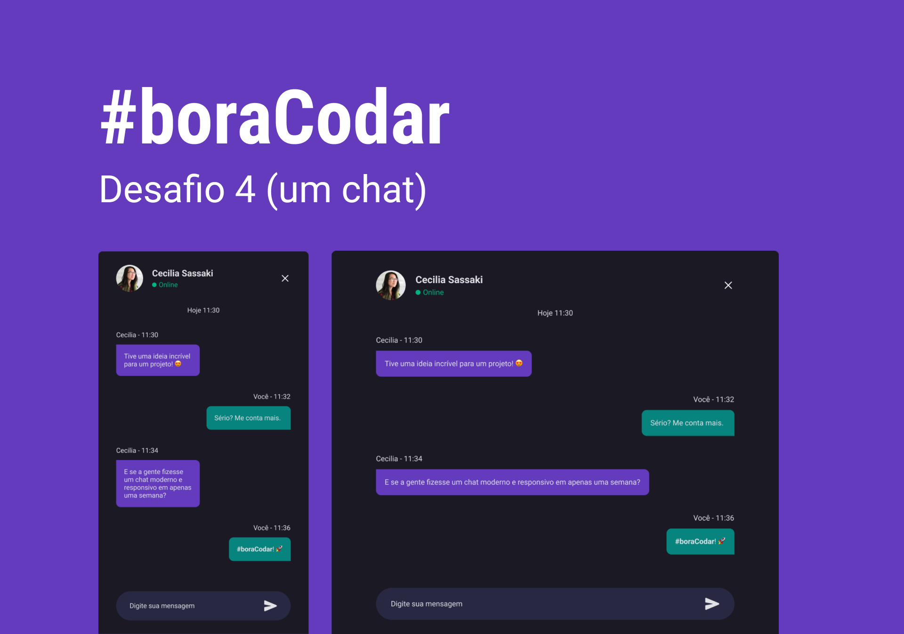

<h1 align="center">
    
</h1>

 

## 🧪 Tecnologias

Esse projeto foi desenvolvido usando as seguintes tecnologias:

- HTML
- CSS:
  - Classes seguindo o padrão [BEM](https://getbem.com/)
  - Uso de [media queries](https://developer.mozilla.org/en-US/docs/Web/CSS/Media_Queries/Using_media_queries) para diminuição dos paddings e remoção da scrollbar de acordo com o tamanho da tela.
  - `textarea` com ajuste automático de altura
- Javascript:
  - tratamento de erro e imagem de fallback no loading diretamente na tag `` com `onerror`
  - emulação de uma conversação de envio e recebimento de mensagens com inclusão de elementos html na DOM.
  - `listener` de [ajuste automático da altura da `textarea`](https://www.youtube.com/watch?v=Yor9Y73M764).

## 🔖 Layout

Você pode visualizar o layout do projeto através do link abaixo:

- [Layout Web](https://www.figma.com/community/file/1200070743637495660)

Lembrando que você precisa ter uma conta no [Figma](http://figma.com/).

## 💻 Projeto

Um chat.

Este foi um projeto desenvolvido como resposta ao desafio 4 do **[boracodar](https://boracodar.dev/#)**, em 1 de fevereiro de 2023.

## Melhorias que podem ser implementadas

- [ ] Funcionamento real com [Socket.IO](https://socket.io/)
