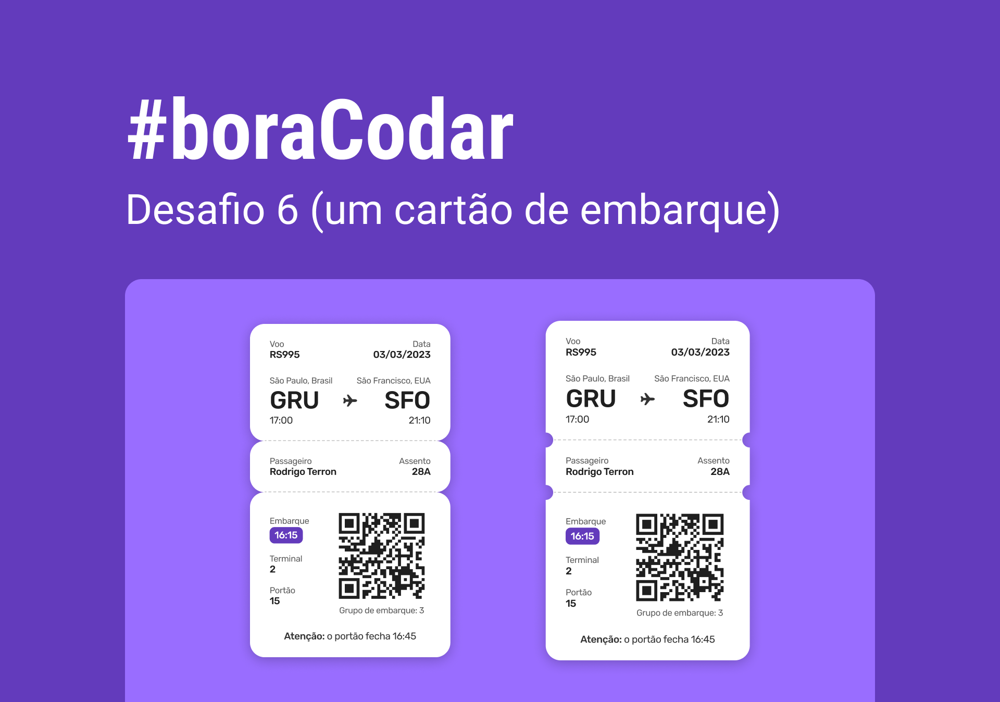

<h1 align="center">
    
</h1>

 

## 🧪 Tecnologias

Esse projeto foi desenvolvido usando as seguintes tecnologias:

- HTML
  - uso de tag `<time datetime=""/>` (com datetime) para melhorar leitura de datas. Uso da tag `<mark />` para texto em highlight (nunca tinha usado :joy:)
- CSS:
  - Uso do `radial-gradient` para fazer bordas em notch.
  - Uso de `@media` queries para adaptar diferenças de layout mobile e desktop.

## 🔖 Layout

Você pode visualizar o layout do projeto através do link abaixo:

- [Layout Web](https://www.figma.com/community/file/1205146101173113980)

Lembrando que você precisa ter uma conta no [Figma](http://figma.com/).

## 💻 Projeto

Uma cartão de embarque responsivo.

Este foi um projeto desenvolvido como resposta ao desafio 6 do **[boracodar](https://boracodar.dev/#)**, em 13 de fevereiro de 2023.
