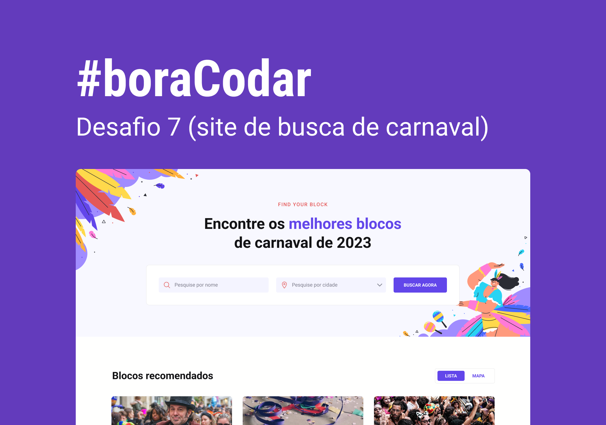

<h1 align="center">
    
</h1>

 

## 🧪 Tecnologias

Esse projeto foi desenvolvido usando as seguintes tecnologias:

- HTML
  - Uso do `<input type='radio'>`.
  - Uso de `<select`>
- CSS:
  - Uso da classe `visually-hidden` para esconder as labels em tela e ainda permitir acessibilidade através de leitores de tela.
  - Uso do `display: grid`
  - Uso de `background-image` na seção hero.
  -
- Javascript
  - `fetch` dos dados dos arquivo json e preenchimento dos dados da tag `template` do html.
  - `map`, `filter`, `forEach` e lib `slugify` na pré-formatação de dados.

## 🔖 Layout

Você pode visualizar o layout do projeto através do link abaixo:

- [Layout Web](https://www.figma.com/community/file/1207675804423978995)

Lembrando que você precisa ter uma conta no [Figma](http://figma.com/).

## 💻 Projeto

Uma cartão de embarque responsivo.

Este foi um projeto desenvolvido como resposta ao desafio 7 do **[boracodar](https://boracodar.dev/#)**, em 21 de fevereiro de 2023.
